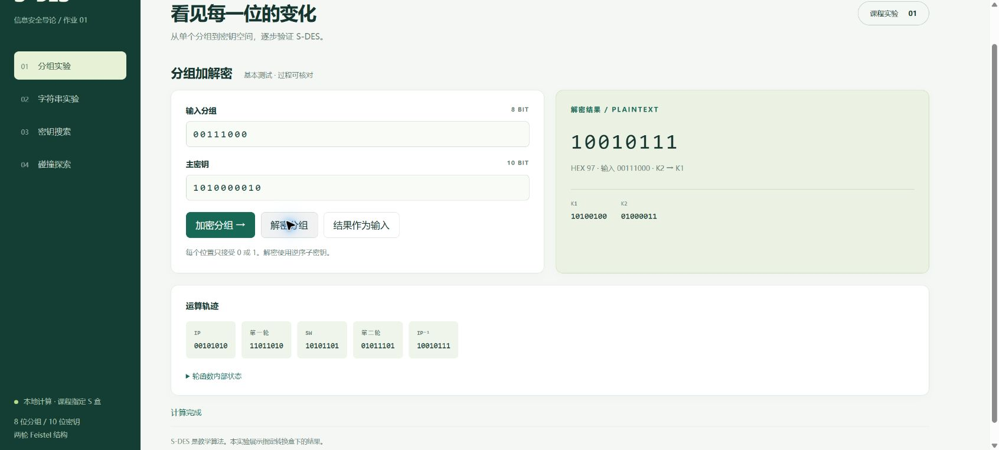
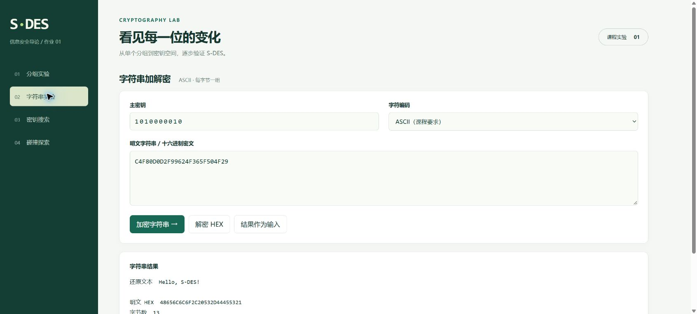
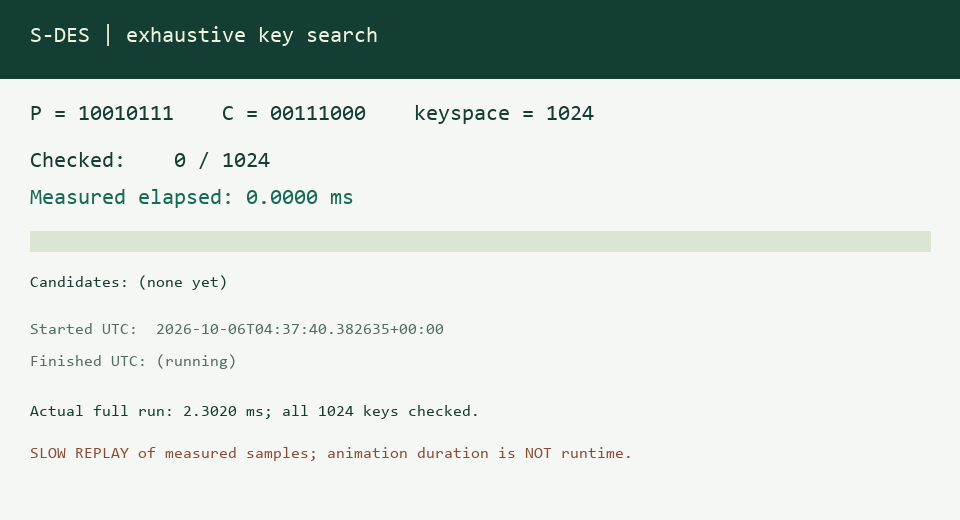
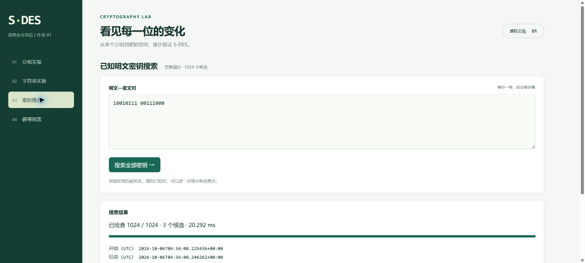
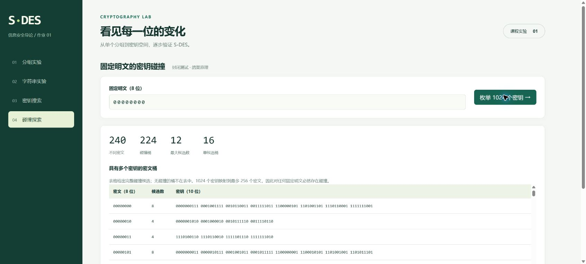

# 五关测试报告

教学班 **992987-001**；小组 **YyH**；成员 **杨凌至、于沂加、黄相茹**。

所有统计来自本仓库代码的真实执行；时间会随设备和运行状态变化。完整 JSON、CSV 和测试输出保存在 `results`。

## 环境与复现

生成时间（UTC）：`2026-10-06T04:37:38.270194+00:00`。Python：`3.12.14 (main, Aug 25 2026, 14:01:42) [MSC v.1944 64 bit (AMD64)]`；平台：`Windows-11-10.0.26200-SP0`。

在根目录运行 `python -m tests.run_experiments` 重新生成原始结果，需要 Python 3.10+ 与 Node.js 18+。运行 `python tools/make_report.py` 更新报告，运行 `python tools/make_animation.py` 更新动图（后者需 Pillow）。

普通单元测试 **9/9 通过**，覆盖合法/非法输入、置换逆运算、1024 个密钥的逐轮跟踪核验、ASCII 全字符、中文扩展、空串、非法 HEX、无解/多解/唯一解及碰撞统计；详见 [完整测试输出](../results/unit_tests.txt)。

## 第一关：基本测试

GUI 可交互输入 8 位分组和 10 位密钥，执行加密或解密，展示二进制、HEX、K1/K2 和运算轨迹。

| 明文 | 密钥 | 密文 | 解密还原 |
| --- | --- | --- | --- |
| `10010111` | `1010000010` | `00111000` | `10010111` |
| `00111111` | `0101001001` | `10101011` | `00111111` |
| `00000000` | `0000000000` | `11110000` | `00000000` |
| `11111111` | `1111111111` | `00001111` | `11111111` |

示例 K1=`10100100`，K2=`01000011`；IP=`01011101` → 第一轮=`10101101` → SW=`11011010` → 第二轮=`00101010` → IP⁻¹=`00111000`。

浏览器实际点击“加密分组”“结果作为输入”“解密分组”，结果分别为 `00111000` 和 `10010111`。GUI 与后端都验证过，没有使用静态结果替代计算。

全空间回环：**1024 个密钥 × 256 个明文 = 262,144 个组合，全部 `D(E(P,K),K)=P`**；每把密钥的 256 个明文也均映射为 256 个不同密文，确认加密是一一映射。

## 第二关：交叉测试

采用两个互补验证来源：

1. 独立 JavaScript 位串实现与 Python 整数/查表实现各自完成 262,144 个组合的加解密回环，并按固定顺序输出密文字节；两者 SHA-256 完全相同：`379855d6f46622f716ed5f2ca210277366235969d83f3dadb199773f4800e8a9`。JavaScript 环境：`v24.18.0`。

2. 对提交表中另一组仓库公开的 CSV，逐行核验本项目加密结果与公开密文一致，解密公开密文还原公开明文；**200/200 行通过，0 行不匹配**。数据保存在 [peer_vectors.csv](../tests/peer_vectors.csv)，來源与局限见 [来源说明](sources.md)。

跨语言核验属于本项目内的独立实现验证；静态公开向量属于与外部已发布结果的兼容性验证。未声称与对方现场联调或运行其源码。可将 [本项目新生成的 200 条向量](../results/cross_vectors.csv) 交给其他小组继续互测。

## 第三关：字符串

ASCII 字符串按每个字节分别加密，长度不变，无填充。密文提供 HEX、二进制和转义字节串，解密 HEX 可无损恢复文本。

| 明文 | 编码 | 字节数 | 密文 HEX | 还原 |
| --- | --- | --- | --- | --- |
| Hello, S-DES! | ascii | 13 | `C4F80D0D2F99624F365F504F29` | 完全一致 |
| This is a test | ascii | 14 | `2268C72762C72762BD624EF8274E` | 完全一致 |
| 信息安全导论 🔐 | utf-8 | 23 | `111E8F92E71DFEE89DFE66DAFE1DE52EE803626DF61451` | 完全一致 |

额外单元测试对 ASCII 0～127 所有字符（包括 NUL、换行和 DEL）在三个边界/示例密钥下均正确还原。ASCII 模式拒绝中文；UTF-8 中文与 emoji 回环通过。空字符串合法；非法 HEX 和错编码明确报错。

浏览器实际加密 `Hello, S-DES!`，再复用 HEX 进行解密，得到原文。

## 第四关：暴力破解

穷举从 0 到 1023 的全部密钥，对每个候选检查所有已知对，保留完整交集。没有在发现真实密钥或首个匹配时提前停止。

单组已知对：P=`10010111`，C=`00111000`。得到 **3 个候选**：`0111001010`、`1010000010`、`1011001010`。真实示例密钥 `1010000010` 包含其中。

实际完整搜索耗时 **2.3020 ms**；开始 UTC `2026-10-06T04:37:40.382635+00:00`，结束 UTC `2026-10-06T04:37:40.383891+00:00`，全部 **1024/1024** 检查完成。

动图由每 64 个候选的真实高精度采样制成，播放人为放慢便于阅读，**播放时长不是运行时间**。计算循环未插入 sleep；进度记录与清空缓存后的子密钥生成包含在耗时内，模块导入的常量表创建不包含。原始时间戳见 [bruteforce_timeline.json](../results/bruteforce_timeline.json)。

增加已知明文 `10010111`、`00000000`、`11111111`、`01000001` 及其相同密钥密文后，候选仍为 **2 个**：`1010000010`、`1011001010`。

再增加区分性已知对 `00001000 → 01110100`，候选缩小到 **1 个**：`1010000010`。另一残留候选 `1011001010` 对该明文输出 `00110010`，因此被排除。

多组已知对的明密文和耗时均在原始 JSON 的 stage4 中。两个矛盾条件（相同明文但不同密文）返回无候选；空已知对会拒绝执行。

GUI 截图和命令行 JSON 属于不同运行；GUI 耗时可受调度、缓存状态及机器负载影响，不沿用另一轮时间。课程将多线程列为可考虑方案，本项目采用单线程完整搜索。

## 第五关：封闭测试

固定随机种子 20261006 选择明文，种子 20261007 选择密钥，得到已知对 `11111101 → 00101001`，真实密钥 `0111010011`。完整搜索得到 **7 个候选**：`0100001111`、`0101000111`、`0110011011`、`0111010011`、`1001000101`、`1011010001`、`1110111110`，说明一组随机明密文对不保证唯一密钥。

对任意固定明文 P，函数 `K ↦ E(P,K)` 的定义域有 1024 个密钥，值域最多 256 个密文。由鸽巢原理，必然存在不同密钥落入同一密文桶；至少有一个桶有 4 个或更多密钥。该证明适用于所有固定明文，但不意味着每个具体密文桶都含多个密钥。

| 全空间统计项 | 实测 |
| --- | --- |
| 固定明文数量 | 256 |
| 每个明文枚举密钥数 | 1024 |
| 是否每个明文都有碰撞 | 是（256/256） |
| 每个明文不同密文数范围 | 238～240 |
| 平均不同密文数 | 239.0 |
| 所有固定明文中的最大密文桶 | 12 个密钥 |
| 明文 00000000 | 240 种密文，224 个碰撞桶，16 个单候选桶 |

明文 `00000000`、密文 `00000000` 的一个碰撞桶包含 `0000000111`、`0001001111`、`0010110011`、`0011111011`、`1100000101`、`1101001101`、`1110110001`、`1111111001`，共 8 把密钥。

完整 256 行汇总见 [collision_summary.csv](../results/collision_summary.csv)。某个固定明文桶中的平均候选数若包括空桶，为 1024/256=4；若仅计非空桶，分母应使用该明文的不同密文数，二者不可混用。

另外比较每把密钥对全部 256 个明文的完整映射，得到 **1024 个不同映射**，全局等价密钥组数量为 **0**（见 [equivalent_keys.json](../results/equivalent_keys.json)）。局部碰撞不等于全局等价；不能从单个已知对的多个候选推断密钥对所有明文均相同。

## GUI 验证范围

实际浏览器操作验证了分组加密→解密、ASCII 加密→解密、完整密钥搜索、碰撞统计四个模块；截图均来自真实页面。输入验证和 UTF-8 扩展另有单元测试与后端接口测试。界面测试使用本机 Chrome；其他系统通过标准 Python/浏览器接口兼容，未虚构其他平台的实际运行记录。
